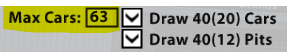
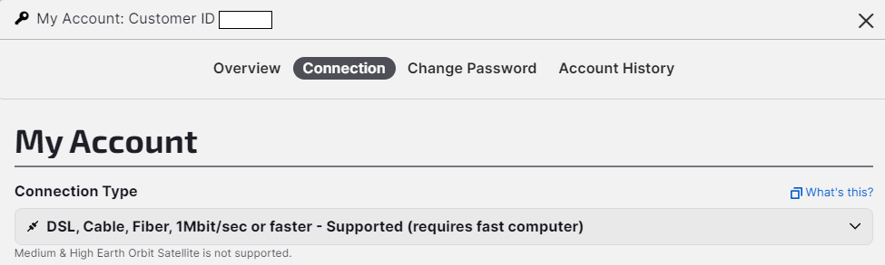

# Racelogger

This document describes how to use the racelogger. The developer documentation can be found [here](./README-dev.md).

The racelogger provides the following commands.

```console
racelogger.exe
```

```
Racelogger for the iRacelog project

Usage:
  racelogger [command]

Available Commands:
  check       check if racelogger is compatible with the backend server
  completion  Generate the autocompletion script for the specified shell
  help        Help about any command
  import      import race from previous logged grpc messages file
  ping        check connection to backend server
  record      record an iRacing event
  server      run racelogger in server mode
  status      check iracing status

Flags:
      --addr string         Address of the gRPC server
      --config string       config file (default is racelogger.yml)
  -h, --help                help for racelogger
      --insecure            allow insecure (non-tls) gRPC connections (used for development only)
      --log-config string   sets the configuration of the internal logger (default "log-prod.yml")
      --log-level string    controls the log level (debug, info, warn, error, fatal) (default "info")
  -v, --version             version for racelogger

Use "racelogger [command] --help" for more information about a command.
```

Along with the executable comes a configuration file

```
# Sample configuration file for the racelogger
# These are the settings for the demo tenant system running at https://demo.iracelog.iracing-tools.de
# Tenants will recieve their own subdomain (instead of demo) and a token
#
# Enter the address of the gRPC server running in the backend
addr: grpc-tenant-in.iracing-tools.de
# Enter the dataprovider token
token:

# Logger configuration
log-level: info
log-config: log-prod.yml

# when running in server mode, the server recieves requests at this address
# if you change this address remember to also change the setting in the frontend
# the frontend is available at https://iracelog.iracing-tools.de/racelogger
service-addr: localhost:8135

```

| Key          | Value       | Info                                                  |
| ------------ | ----------- | ----------------------------------------------------- |
| addr         | `host:port` | This is the address of the backend server             |
| token        |             | A secret credential to identify valid racelogger user |
| log-level    | `info`      | The level used for logging                            |
| log-config   |             | path to logger configuration (format,output,...)      |
| service-addr | `host:port` | listen addr when running in server mode               |

**Notes about TLS**

In general the backend is running behind a proxy. One job of the proxy is to handle the TLS termination.
The instances running at iracing-tools.de use a Traefik proxy which is also responsible for providing the Let's encrypt certificates.
In these cases you don't need to configure any TLS parameters.

In situations where the backend is configured to use additional TLS features you may need to configure the following settings.

| Key      | Info                                 |
| -------- | ------------------------------------ |
| tls-ca   | file containing the root certificate |
| tls-key  | file containing the client key       |
| tls-cert | file containing the client cert      |

## Check

Enter the address of the backend server into the `racelogger.yml` file and perform a version check.

```console
racelogger.exe check
```

```
Racelogger version  : v0.22.0
Server version      : v0.34.0
Minimum racelogger  : v0.20.0
Compatible          : true
Valid credentials   : true
```

## Record

Here is an example how to record a race. Ensure the iRacing simulation is running and connected to a race.
Let's assume we are connected to a session of the Sebring 12h special event.

```console
racelogger.exe record -n "Sebring 12h" -d "Split #2"
```

This will start the recording and send data to the backend server every second. Once the race has finished the programm will stop.

_Tip:_ Use double quotes (") around values containing blanks and/or other special characters.

### Recording Heat Events

When recording heat events each race session will be recorded as a separate event. In order to assign different names and/or descriptions you may provide multiple arguments.
Name and description will be assigned to each race in the order provided. If there are more races than provided parameters the last one will be used.

For example: Recording a Heat where the heat race should be a sprint race and the feature race should be the main race.

```console
racelogger.exe record -n "Sample event" -d "Sprint" -d "Race"
```

This will record two events:

-   name: "Sample event", description: "Sprint"
-   name: "Sample event", description: "Race"

**Notes**:

-   Make sure you have set MaxCars to 63 in iRacing. This setting defines the amount of cars for which the iRacing server transfers data to the iRacing simulator.  
    In order to get a complete race overview we need the data for all cars. Note, this setting is just for the data transfer.  
    You find this setting in the iRacing simulator at Options -> Graphic  
    

-   Make sure you have the highest available connection type setting active. You find this in your iRacing account page in the preferences section.  
     The setting DSL, Cable, Fiber, 1MBit/sec or faster seems to work best without losing any data.  
       
     When using a smaller value this may cause iRacing to send fewer car data at times which in turn causes the racelogger to assume that a car is offline and mark it as OUT during the period when no data is recieved for a particular car.

-   **Warning:** When recording you should not use the iRacing replay function. Some telemetry values will be invalidated when the replay mode is active. In such cases the racelogger may produce invalid data.

### Log messages while recording

You may want to log the messages that are sent to the server. This may be useful if the connection to the server is lost. You may import the logged messages later.

```console
racelogger.exe record -n "Sebring 12h" -d "Split #2" --msg-log-file grpc-data.bin
```

The recorded messages are stored in a binary format in the file `grpc-data.bin`.

## Server mode

Starting with v0.22.0 the racelogger can be run in server mode. The command is

```console
racelogger.exe server
```

The racelogger is controlled by the frontend page at https://iracelog.iracing-tools.de/racelogger

Use this page to control the recording.

## Ping

To test the connection to server you may use the ping command. This will send 10 pings to the server with an interval of 1 second between two pings.

```console
racelogger.exe ping -n 10 -d 1s
```

## Import

Let's assume the connection to the backend server was lost during recording. Luckily we enabled the message logging during recording via the `--msg-log-file grpc-data.bin` option (see above).
After the race has finished we want to import the data to the backend.

Best practise is to replace the (partial) data on the server with the import file.

```console
racelogger.exe import --replace-data grpc-data.bin
```
